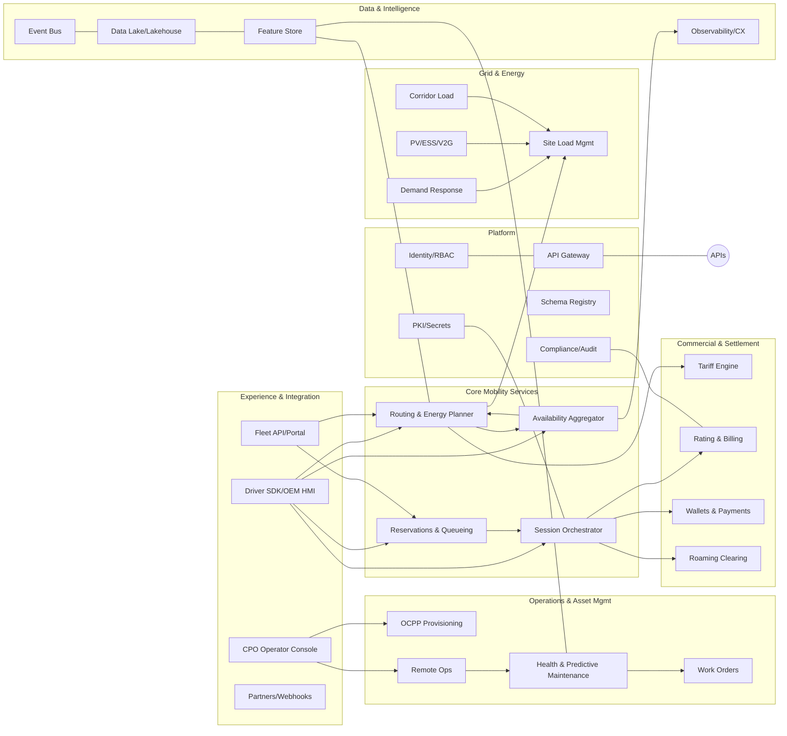

# EV Corridor Charging Management – System Specification (v1)

## 1. Purpose & Scope
A software platform that plans, orchestrates, and settles EV charging along road networks (corridors, highways, arterial routes). It integrates drivers, fleets, charge point operators (CPOs), roaming hubs, grid actors, and payment providers to deliver reliable, efficient, and transparent charging experiences.

**Out of scope (initial release):** Home charging, non-road micro-mobility, custom hardware design.

## 2. Goals & Non‑Goals
**Goals**
- Minimize trip time variance and charge failures.
- Maximize station utilization without causing local congestion or grid constraint violations.
- Offer transparent pricing, reservations/queueing, and frictionless payments, including roaming.
- Provide operators with remote ops, analytics, and predictive maintenance.

**Non‑Goals**
- Building a navigation app from scratch (we provide SDKs/APIs for existing nav clients).
- Acting as a market operator for energy trading (we integrate where needed).

## 3. Stakeholders & Actors
- **Drivers/Passengers** (mobile app or OEM HMI)
- **Fleet Managers** (portal/API)
- **CPO Operators** (NOC/portal)
- **Roaming Hubs** (OCPI/OICP/eMIP)
- **Grid/DSO/TSO & Flex Aggregators** (OpenADR/API)
- **Payment Service Providers (PSPs)/Acquirers** (EMV/PCI APIs)
- **OEMs** (ISO 15118/vehicle telematics)

## 4. Key Standards & Interfaces
- **OCPP 1.6/2.0.1** (station control)
- **OCPI 2.2.x / OICP / eMIP** (roaming)
- **ISO 15118‑2/20** (Plug&Charge), **ISO 61851** (conductive charging)
- **OpenADR 2.0b** (demand response)
- **PCI DSS / EMV Contact/Contactless**, **3DS**, **PSD2 SCA** (payments)
- **MID / Weights & Measures** (billing accuracy)
- **OAuth2/OIDC**, **mTLS**, **PKI** (security)

---

## 5. Logical Decomposition

### 5.1 Top-Level Domains
1. **Experience & Integration Layer**
   - Driver App SDK & OEM HMI adapter
   - Fleet API & Portal
   - CPO Operator Console
   - Webhooks & Partner Integrations (maps, parking, hospitality)

2. **Core Mobility Services**
   - Routing & Energy Planning
   - Reservations & Virtual Queueing
   - Availability & Capability Aggregation (multi-network)
   - Session Orchestrator (start/stop/monitor)

3. **Commercial & Settlement**
   - Tariff & Product Catalog
   - Rating & Billing (CDR ingestion, taxation, proration)
   - Wallets & Payments (PSP connectors)
   - Roaming Clearing (OCPI/OICP CDR exchange)

4. **Operations & Asset Management**
   - Charger Provisioning (OCPP onboarding)
   - Remote Ops (commands, firmware, config)
   - Health & Predictive Maintenance (telemetry, fault models)
   - Work Orders & Spares

5. **Grid & Energy Optimization**
   - Site Load Management (intra‑site power sharing)
   - Corridor Load Coordination (inter‑site balancing)
   - DR & Flexibility (OpenADR client)
   - PV/ESS Orchestration & V2G

6. **Data & Intelligence**
   - Event Bus & Stream Store
   - Data Lake/Lakehouse (sessions, telemetry, prices)
   - Feature Store & ML Pipelines (ETA, failure risk, demand forecast)
   - Observability (logs, metrics, traces) & CX Analytics

7. **Platform & Shared Services**
   - Identity & Entitlements (RBAC/ABAC)
   - Secrets/PKI (HSM, cert lifecycle for ISO 15118/OCPP)
   - API Gateway & Rate Limiting
   - Schema Registry & Contract Testing
   - Compliance & Audit (W&M/MID, GDPR retention)

### 5.2 Component Breakdown (selected)
- **Routing & Energy Planner**: SOC‑aware consumption modeling (grade, weather, traffic), station scoring, re‑planning.
- **Reservation Service**: Holds/commits connector/time window; virtual queue with ETA; no‑show/penalty logic.
- **Availability Aggregator**: Normalizes station status, connectors, power, occupancy from CPOs and hubs.
- **Session Orchestrator**: Orchestrates auth (P&C tokens, OAuth), start/stop, meter reads, exception handling.
- **Tariff Engine**: Computes total cost incl. energy, idle, TOU, demand charges, taxes, roaming fees.
- **Billing/Ratings**: Session rating → invoice/receipt → settlement & reconciliation.
- **Ops Control**: OCPP command proxy, firmware mgmt, parameter sets, signage (VMS) push.
- **Telemetry Ingest**: Fault codes, temperatures, power curves; backpressure & lossless buffering.
- **DR Coordinator**: Applies grid events to sites, enforcing SOC floors and customer entitlements.
- **ML Services**: Utilization forecast, failure propensity, price prediction, route ETA correction.

---

## 6. Logical Diagram

---

## 7. Key Data Objects (high level)
- **Site**(id, geo, feeder_limit, amenities, safety_score)
- **Charger**(id, site_id, ocpp_id, model, firmware, connectors[])
- **Connector**(type, max_kw, status, price_product_id)
- **Reservation**(id, site_id, connector, start_ts, end_ts, status)
- **Session**(id, vehicle_id, auth_mode, meter_start/stop, kWh, price, taxes, cdr_ref)
- **Tariff/Product**(id, pricing rules, idle fees, TOU, roaming terms)
- **Telemetry**(timestamp, station_id, metrics, faults)
- **DR Event**(scope, start/end, shed_kw, incentives)

---

## 8. Principal Flows (summaries)

### 8.1 Route‑Aware Charge Planning
1. Client submits: vehicle spec, SOC, payload, route polyline, timing.
2. Planner models energy; queries **Availability** and **Tariff**; scores candidate sites.
3. Returns plan with stops, durations, arrival SOC buffers, cost estimate, confidence.
4. Optional: auto‑reserve via **Reservations**.

### 8.2 Session Orchestration (Start → Stop)
1. Auth: Plug&Charge token → OEM cloud → **Session Orchestrator** (fallback: app/QR/NFC).
2. Start command via CPO (OCPP) or roaming hub; capture meter start.
3. Monitor power, faults; adjust plan; enforce idle fees.
4. Stop; read meter; **Billing** rates; **Payments** charges; emit CDR; receipt.

### 8.3 Grid Curtailment
1. **DR** receives OpenADR event; computes feasible curtailment per site.
2. **Site Load Mgmt** adjusts limits; **Planner** and **Reservations** re‑score options.
3. Notify affected sessions; protect emergency/priority entitlements.

---

## 9. Deployment View (conceptual)
- **Control Plane (cloud)**: Core services, data/ML, ops consoles, gateways, observability.
- **Edge at Site**: Load controller, cache of tariffs/entitlements, offline queue for CDRs, secure key store.
- **Vehicle/OEM**: Lightweight client; SOC & telematics; ISO 15118 certificates.
- **Partner Clouds**: CPO backends, PSPs, roaming hubs, DSO/TSO signals.

**Isolation & Multi‑tenancy**: Tenant‑scoped data domains; per‑tenant keys; rate limits; API quotas.

---

## 10. Quality Characteristics & Tactics

### 10.1 Availability & Reliability
- **Tactics**: Active‑active across regions; circuit breakers/timeouts; idempotent commands; retry with jitter; SLA probes from synthetic clients; blue/green for OCPP/OCPI connectors.
- **Design Choices**: Event‑sourced **Session Orchestrator**; write‑ahead log for CDRs; edge offline cache with conflict resolution on reconnect.
- **Metrics**: >99.95% API availability; first‑attempt start success rate; MTTR < 30 min.

### 10.2 Scalability & Performance
- **Tactics**: CQRS separation; horizontal autoscaling; read models in Redis/Key‑Value; geo‑partitioned data (by corridor/region); backpressure and bulkheads on third‑party connectors.
- **SLOs**: Route plan P95 < 800 ms; availability refresh ≤ 5 s end‑to‑end; payment auth P95 < 300 ms.

### 10.3 Security & Privacy
- **Tactics**: mTLS for OCPP/OCPI; HSM‑backed PKI for ISO 15118; OAuth2/OIDC; least‑privilege RBAC/ABAC; encrypted data at rest; tokenized PANs via PSP; SBOM & signed firmware; continuous vuln scanning; anomaly detection on sessions/payments.
- **Privacy**: Data minimization; per‑purpose consent; GDPR data subject tools; location fuzzing for analytics.

### 10.4 Interoperability
- **Tactics**: Protocol adapters (OCPP/OCPI/OICP/OpenADR) behind contract‑tested facades; schema registry; versioned APIs; roaming conformance test suite; feature flags per CPO.

### 10.5 Observability & Supportability
- **Tactics**: RED/USE metrics; distributed tracing with correlation IDs across partner calls; structured events; domain dashboards; root‑cause tagging for failed sessions; replayable event streams.

### 10.6 Maintainability & Evolvability
- **Tactics**: Hexagonal architecture; domain‑bounded contexts; automated contract tests; platform platformization (shared infra as product); ADRs and API change logs; scaffolded SDKs.

### 10.7 Cost Efficiency
- **Tactics**: Spot/arm savings plans for stateless compute; storage lifecycle policies; tiered retention (hot/warm/cold); edge pre‑aggregation to cut egress.

### 10.8 Safety & Compliance
- **Tactics**: Enforce SOC floors; emergency stop priority; W&M/MID attestation and calibration audits; incident runbooks; secure remote firmware with rollback; staging certification environment.

### 10.9 User Experience
- **Tactics**: Confidence bands on ETA/cost; graceful degradation with clear messaging; accessibility surfacing (cable reach, lighting); proactive alternative offers on outage.

---

## 11. Risk Register (selected)
- **Roaming data inconsistency** → Mitigation: multi‑source reconcile, reputation‑weighted trust, health scoring.
- **Demand spikes (holiday peaks)** → Mitigation: reservation windows, surge idle fees, pop‑up mobile chargers.
- **Grid constraints** → Mitigation: DR incentives, PV/ESS, predictive corridor balancing.

---

## 12. Non‑Functional SLO Summary
| Area | Target |
|---|---|
| API availability | 99.95% monthly |
| Plan response (P95) | < 800 ms |
| Station status freshness | ≤ 5 s |
| Payment auth (P95) | < 300 ms |
| CDR delivery | 99.99% within 15 min |

---

## 13. Open Questions / Next Steps
- Target corridors and initial CPO partners?
- Required certifications and jurisdictions for W&M/MID?
- OEM partners for ISO 15118 tokens?
- Data residency constraints per region?

## 14. Future Factors, Risks & Mitigations
This section identifies external and internal factors—business, technical, organizational, and political—that may affect the solution. For each risk we outline the impact, give reasoning, and prescribe concrete mitigations with implementation hooks in the platform.

### 14.1 Risk Heatmap (summary)
| Category | Risk | Likelihood | Impact | Overall |
|---|---|---|---|---|
| Business | Roaming price volatility & opaque fees | High | High | **Critical** |
| Business | Demand uncertainty (adoption & traffic variance) | Medium | High | **High** |
| Technical | Protocol/standard drift (OCPP/OCPI/ISO15118) | High | High | **Critical** |
| Technical | Third‑party outages/quality (CPOs, hubs, PSPs) | High | High | **Critical** |
| Security | Compromise of charger/OEM credentials or tokens | Medium | High | **High** |
| Ops | Firmware bugs / hardware EOL & supply constraints | Medium | High | **High** |
| Data/AI | Forecast/ML drift drives bad planning | Medium | Medium | **Medium** |
| Regulatory | Metrology, VAT/e‑invoicing, data residency shifts | Medium | High | **High** |
| Political | Subsidy, tariff, or sanction changes | Low | High | **Medium** |
| Social | Accessibility & safety expectations increase | Medium | Medium | **Medium** |

> Likelihood/Impact use a relative 12–24 month horizon; reassess quarterly.

---

### 14.2 Detailed Risks, Impacts, and Mitigations

#### A. Business & Market
1) **Roaming price volatility & opaque fees**  
**Impact:** Cost overruns vs. quote, driver dissatisfaction, margin erosion.  
**Reasoning:** CPO tariffs, idle fees, and roaming markups vary frequently and may be disclosed late.  
**Mitigations & Implementation:**  
- **Tariff ingestion diffing** with effective‑date scheduling; stale‑price quarantine. (Extend *Tariff Engine* with versioned rule sets + validity windows.)  
- **Confidence bands in quotes**; display price range based on historical variance. (*Experience Layer* UI + *Tariff* API.)  
- **Multi‑source reconciliation** of prices across roaming hubs; flag anomalies for ops. (*Availability Aggregator* + *Data Lake* checks.)  
- **Contracts catalog** to apply negotiated caps/discounts per tenant. (*Commercial & Settlement* policy store.)

2) **Demand uncertainty (EV adoption, traffic peaks, charger utilization)**  
**Impact:** Over/under provisioning, SLA breaches during holidays/events.  
**Mitigations & Implementation:**  
- **Elastic reservations** with blackout calendars and surge idle fees. (*Reservations Service* rule profiles.)  
- **Digital‑twin corridor simulator** to test scenarios (holiday peaks, weather). (*Data & Intelligence* pipeline + batch what‑if service.)  
- **Pop‑up/mobile charger integration** as a resource type with rapid onboarding. (*Provisioning* + *Planner* site capabilities.)

3) **Platform fragmentation & exclusive ecosystems** (OEM alliances/super‑networks)  
**Impact:** Reduced coverage, higher roaming costs, degraded experience.  
**Mitigations:**  
- **Protocol adapter portfolio** (OCPI/OICP/eMIP) behind contract‑tested facades; **feature flags per partner**. (*Platform* + *Interoperability* façade.)  
- **SDK licensing model** for OEM in‑dash integration; **graceful fallbacks** to QR/app. (*Experience Layer* + *Gateway*.)

4) **Payments regulation & fee changes (PSD*, interchange caps, surcharging)**  
**Impact:** Margin compression; auth declines due to SCA changes.  
**Mitigations:**  
- **Payments provider abstraction** with routing rules; auto‑failover and least‑cost routing. (*Wallets & Payments*.)  
- **Dynamic SCA policy** (risk‑based 3DS, cached exemptions) with telemetry. (*Identity* + *Payments*.)

5) **Cross‑border tax/VAT/e‑invoice complexity**  
**Impact:** Compliance risk, reconciliation delays.  
**Mitigations:**  
- **Jurisdictional tax plugins** with declarative rules & date‑scoped versions. (*Billing*.)  
- **E‑invoice connectors** per country; sandbox conformance suites. (*Commercial & Settlement*.)

---

#### B. Technical & Interoperability
6) **Protocol & standard drift (OCPP 2.0.1 → 2.1, ISO 15118‑20 variants, OCPI extensions)**  
**Impact:** Breakages, feature gaps, certification churn.  
**Mitigations:**  
- **Schema Registry** & **contract tests** for each partner; canary environments per protocol version. (*Platform*.)  
- **Adapter compatibility matrix** with auto‑downgrade/upgrade and capability negotiation. (*Session Orchestrator* + *Provisioning*.)

7) **Third‑party outages & poor data quality (CPO, roaming, PSP, weather/traffic)**  
**Impact:** Failed session starts, wrong availability, payment declines.  
**Mitigations:**  
- **Bulkheads & circuit breakers** per connector; **SLA‑aware routing** to healthier providers. (*Gateway* + *Availability Aggregator*.)  
- **Synthetic probes** from multiple regions; **trust scores** per station/source. (*Observability/CX* + *Data Lake*.)  
- **Offline mode** with cached entitlements/tariffs and deferred CDRs. (*Edge at Site* + *Session Orchestrator*.)

8) **Charger firmware bugs / hardware EOL**  
**Impact:** Widespread failures, safety issues, costly truck rolls.  
**Mitigations:**  
- **Signed firmware with staged rollout & rollback**; health gates post‑upgrade. (*Remote Ops*.)  
- **Spares/EOL registry** mapping models → parts; proactive replacement plans. (*Work Orders & Spares*.)

9) **Scalability limits under holiday peaks**  
**Impact:** Latency spikes, timeouts → failed sessions & re‑planning storms.  
**Mitigations:**  
- **CQRS + read models** for hot paths; **event‑sourced** session core. (*Core Mobility*.)  
- **Autoscaling with rate‑limit budgets** per tenant; **priority lanes** for in‑progress sessions. (*Gateway* + *Session Orchestrator*.)

10) **Edge/last‑mile connectivity failures** (cellular backhaul, SIM theft)  
**Impact:** Orphaned sessions, degraded telemetry.  
**Mitigations:**  
- **Dual SIM/multi‑APN** support, **store‑and‑forward** at edge, **attestation of modem identity**. (*Edge* + *PKI/Secrets*.)

---

#### C. Security, Privacy & Safety
11) **Credential/token compromise (P&C certificates, OAuth, API keys)**  
**Impact:** Fraudulent sessions, data breach, brand damage.  
**Mitigations:**  
- **HSM‑backed key management** and short‑lived tokens; **mutual TLS** for charger/cloud. (*PKI/Secrets*.)  
- **Anomaly detection** for geovelocity, repeated reversals, impossible meter deltas; auto‑lock & challenge flows. (*Data & Intelligence* + *Payments*.)

12) **Ransomware or supply‑chain attacks**  
**Impact:** Outages, compliance incidents.  
**Mitigations:**  
- **SBOMs, signed artifacts, reproducible builds**; **principal‑of‑least‑privilege** runtime (OPA/ABAC). (*Platform*.)  
- **Backup & restore drills**, **break‑glass** keys with continuous testing. (*Operations*.)

13) **User safety & site security (lighting, vandalism)**  
**Impact:** Injury risk, reputational damage, legal exposure.  
**Mitigations:**  
- **Safety metadata** (lighting, CCTV, staffed hours) surfaced in planning; **SOS escalation**. (*Availability* + *Experience Layer*.)  
- **Incident correlation** (crime stats + CX complaints) to demote risky sites. (*Data & Intelligence*.)

14) **Privacy & data residency shifts**  
**Impact:** Service fragmentation, fines.  
**Mitigations:**  
- **Data domain tagging** with residency/retention policies; **region‑pinned storage** and **processing controls**. (*Data Platform* + *Compliance*.)

---

#### D. Organizational & Process
15) **Talent scarcity & attrition in EV/energy protocols**  
**Impact:** Slow delivery, knowledge loss.  
**Mitigations:**  
- **Guilds & internal certifications** on OCPP/OCPI/ISO; **runbooks/ADRs** and **design docs** as first‑class artifacts. (*Engineering Enablement*.)

16) **Vendor lock‑in / single‑cloud dependence**  
**Impact:** Cost spikes, regional outages.  
**Mitigations:**  
- **Portable primitives** (K8s, Terraform, Postgres‑compat), **S3‑compatible object storage**, **abstraction layers** for proprietary services. (*Platform*.)

17) **Change management & partner onboarding friction**  
**Impact:** Long time‑to‑revenue, repeated integration bugs.  
**Mitigations:**  
- **Self‑serve partner portal**, **conformance test harness**, and **mock hubs**; certification badges. (*Experience & Platform*.)

---

#### E. Regulatory, Political & Environmental
18) **Sudden regulatory changes (metrology, right‑to‑repair, accessibility)**  
**Impact:** Rework of billing/UX, hold on operations in some regions.  
**Mitigations:**  
- **Policy engine** for presentment (units, receipts, price transparency); **versioned compliance profiles** per region. (*Commercial* + *Experience* + *Compliance*.)

19) **Geopolitical shocks (sanctions, trade tariffs, spectrum rules)**  
**Impact:** Hardware shortages, roaming embargoes.  
**Mitigations:**  
- **Approved vendor lists** with multi‑source alternatives; **component BOM mapping** for exposure. (*Ops & Supply Chain*.)  
- **Feature flags** to disable embargoed endpoints by region. (*Gateway*.)

20) **Grid stress & climate events (heatwaves, storms, wildfires)**  
**Impact:** Curtailment, blackouts, damaged infrastructure.  
**Mitigations:**  
- **DR integration** with incentives and opt‑downs; **microgrid/ESS orchestration** and **black‑start** runbooks. (*Grid & Energy*.)

---

### 14.3 Embedding Mitigations into the System
- **Policy & Rules Layer**: Central policy engine (OPA/rego or equivalent) for tariffs, reservations, DR entitlements, compliance presentment; versioned and auditable.  
- **Capability Negotiation**: During provisioning, detect charger/OEM capabilities and pin adapter behavior; store in the **Capabilities Registry** used by Planner/Session.  
- **Trust & Quality Scores**: Compute source/station trust scores (freshness, error rates, CDR mismatch) and feed them to routing/selection.
- **Resilience Patterns**: Bulkheads, circuit breakers, poison‑queue isolation, idempotency keys, saga orchestration for cross‑service transactions.  
- **Security Controls**: HSM for key material; certificate rotation services; hardware attestation where possible; anomaly signals wired to auto‑mitigations (lock/step‑up auth).
- **Observability by Design**: Correlation IDs across partner calls; RED/USE KPIs; SLOs tied to alerts and error budgets; synthetic clients at critical user journeys.
- **Data Governance**: Domain‑based data products with residency/retention tags; lineage; PII vault; deletion workflows; table‑level ACLs.
- **Cost & Scale Guardrails**: Per‑tenant budgets and autoscaling HPA tied to SLOs; load‑shedding for non‑critical features during peaks.

### 14.4 Leading Indicators to Monitor
- Price change frequency and variance by CPO/region.
- Start‑success rate by protocol version and firmware family.
- Reservation no‑show and queue abandonment rates.
- SLA and freshness of availability feeds per source; trust score drifts.
- Payment auth decline reasons by issuer/region.
- DR event frequency and magnitude; curtailment compliance.
- Model performance deltas (MAPE for demand/power, AUC for fraud).
- Safety incident density and CX complaint clusters per site.

### 14.5 Playbooks & Ownership
- **Roaming price anomaly** → *Commercial Ops* + *Data* triage; cap exposure via contract overrides; notify users with revised quotes.  
- **Partner outage** → *SRE* initiates failover policy; Planner demotes affected sites; activate offline mode where supported.  
- **Security anomaly** → *SecOps* auto‑lock keys/tokens; customer comms; credential rotation job.  
- **Firmware incident** → *Ops Control* halts rollout; roll back cohort; RMA workflow; publish RCA.

### 14.6 Roadmap of Risk‑Reducing Enhancements
1. Partner self‑cert portal & automated contract tests.  
2. Pricing variance service with alerts & confidence‑aware quotes.  
3. Corridor digital twin MVP for holiday/event simulations.  
4. Payments router with least‑cost and failover logic.  
5. Residency‑aware data domains and e‑invoice connectors (priority corridors).  
6. Trust scoring for availability sources feeding the Planner.  
7. HSM‑backed PKI and charger attestation rollout plan.

